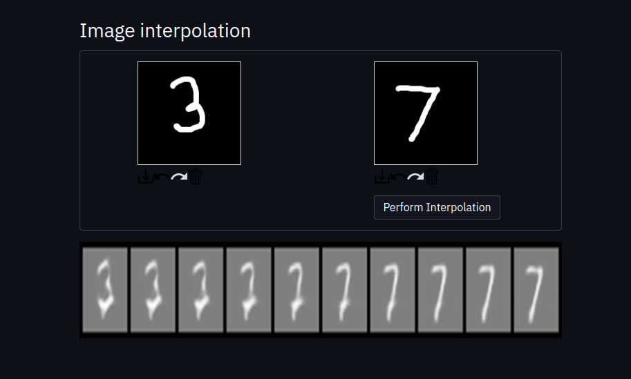

# convolutional VAEs with user interface
This is a mini project that is based on this medium tutorial series https://towardsdatascience.com/beginner-guide-to-variational-autoencoders-vae-with-pytorch-lightning-13dbc559ba4b



clone this repo

Make sure the required packages are installed
```
pip3 install -r requirements.txt 
```

To run the interface write in the cmd/terminal
```
streamlit run app.py
```